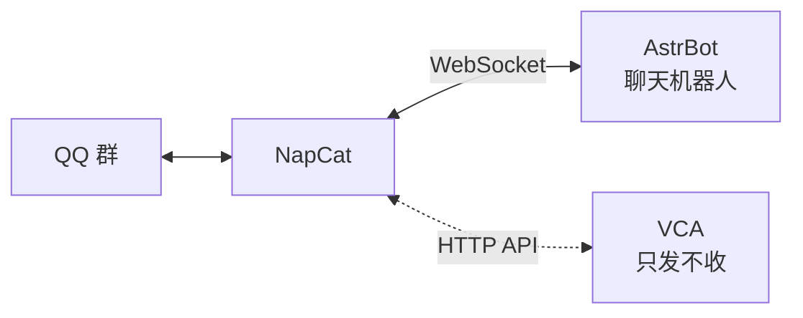

# 推送配置与本地机器人部署

VCA 的推送目标不是某个平台的 SDK，而是**一个 HTTP 端点**。
最常见的部署是「NapCat（登录 QQ）+ VCA（发消息）」。

---

## 一、最短可用路径：NapCat

1. **装 NapCat**。两种走法，任选：

   - **界面里一键装**（推荐）：「推送」页下半部分那张「QQ 机器人（NapCat）」卡片
     → 点「一键安装」→ 点「启动」→ 首次启动要扫码登录 QQ，
     二维码就在卡片下方的「启动日志」里。
     装到 `<程序目录>\tools\napcat\`，不写 C 盘。
     自动下载失败（校园网访问 GitHub 不通）时，卡片会给出提示；
     点「打开下载页」手动下 `NapCat.Shell.zip`，再点「打开目录」解压进去，
     刷新后即可自动识别。
   - **自己装**：下载 [NapCat](https://github.com/NapNeko/NapCatQQ)，
     按它的文档登录一个 QQ 号。

   > **建议用小号**：这属于第三方协议登录，有账号风险。

   注意：Shell 包需要本机已装 QQ（它是 QQ 的注入式插件）；没装 QQ 就用便携包。
   程序识别这两种形态，入口找不到时不会瞎启动，而是直接告诉你缺什么。

2. 在 NapCat 配置里打开 **HTTP 服务端**，记下端口（默认 `3000`）与 access token
3. 把这个 QQ 号拉进你要接收课堂纪要的群
4. 配 VCA 的 `config/profiles/default/settings.yaml`：

```yaml
push:
  provider: "onebot"
  endpoint: "http://127.0.0.1:3000"
  target: "你的群号"
  target_type: "group"
```

token 不要写进这个文件，放 `secrets.env`（同目录）或环境变量：

```
VCA_PUSH_TOKEN=你的access_token
```

5. **验证**：

```powershell
vca.exe debug push-test
```

它会把实际使用的配置原样打出来（token 打码），并真的发一条测试消息。
`config/profiles/default/` 就是配置目录；交互界面主菜单「2 配置推送」也能配。

---

## 一之二、企业微信智能机器人（新版）

企业微信后台「创建智能机器人」给的是 **机器人 ID + Secret**，走 WebSocket 长连接，
和上面那条 Webhook 完全不是一回事。本程序两种都支持：

> ⚠️ **智能机器人发不了附件。** 协议只支持 Markdown 与模板卡片，
> 所以走这条通道时推送的是「要点摘要 + 本机文档路径」，
> 带截图的 Word 留在本机。要发文件请用 Webhook 或 OneBot。

配置（「推送」页选「企业微信智能机器人（新版）」）：

| 字段 | 说明 |
|---|---|
| 机器人 ID / Secret | 企业微信后台「智能机器人」页 |
| 会话 id | 单聊填 userid，群聊填 chatid（配 `push.target`） |
| WebSocket 地址 | 留空即用官方地址 `wss://openws.work.weixin.qq.com` |

凭据放在 `secrets.env`，变量名是 `VCA_WECOM_BOT_ID` / `VCA_WECOM_BOT_SECRET`
（与 QQ 官方机器人的 `VCA_QQ_APP_*` 分开，互不干扰）。

**会话 id 怎么拿**：界面上有「获取会话」按钮。它的原理是连上企业微信、
认证、然后**监听 15 秒**，收集这段时间里出现在消息中的会话。

原因是企业微信**不提供**会话列表接口：智能机器人是回调制的，
会话 id 只在别人对机器人说话时送过来。所以：

- 它只能列出「最近和机器人有过互动的会话」；
- 想让某个群出现，先把机器人拉进群、在群里 @ 它一次，再点一次「获取会话」；
- 认不出的帧会原样显示在界面上（官方改字段名时用来定位）。

**协议实现的验证程度**（诚实说明）：认证帧、发送帧、`req_id` 回执匹配都按官方
`@wecom/aibot-node-sdk` 的实现写，并且**真连过一次企业微信的服务器**——
用假凭据拿到了 `errcode=853000 invalid bot_id or secret`，
说明 TLS 握手、协议升级、认证帧解析、回执匹配这几步全部正常，
只差一套真实凭据。真实凭据下的完整链路尚未验证。

---

## 一之三、其它机器人（一行配置就够的）

下面这些都不需要在本地跑任何东西，填一个地址或一个 token 就能用：

| 渠道 | 填什么 | 备注 |
|---|---|---|
| Telegram Bot | Bot Token + chat_id | chat_id 可在界面点「获取会话」自动填 |
| 钉钉机器人 | Webhook（+ 加签密钥） | 加签算法：`hmac(secret, "{ts}\n{secret}")` → base64 → urlencode |
| 飞书机器人 | Webhook（+ 签名密钥） | 注意与钉钉**不同**：key 是 `"{ts}\n{secret}"`，对**空串**求 HMAC |
| Discord / Slack | Webhook 地址 | — |
| Bark | device key | 推到 iOS，可用自建服务器 |
| ntfy | topic 名 | 开源，可用自建服务器 |
| PushPlus | token | 推到微信 |

它们的平台协议都不支持附件，所以推送内容是「摘要 + 本机文档路径」。
要连 Word 一起发，用 OneBot 或企业微信群机器人 Webhook。

凭据（token / 密钥）一律写进 `config/secrets.env`，不进版本库。

---

## 二、AstrBot 放在哪

[AstrBot](https://github.com/AstrBotDevs/AstrBot) 是**对话机器人框架**，
它自己也需要一个 OneBot 实现（同样是 NapCat）才能上 QQ。

所以三者的关系是：



**关键点：NapCat 可以同时开 HTTP API 与 WebSocket。**
AstrBot 走 WebSocket、VCA 走 HTTP，两者互不干扰 ——
**VCA 不需要经过 AstrBot 中转**，直连同一个 NapCat 就行，链路更短、少一层故障点。

什么时候才需要经过 AstrBot：想让课堂纪要触发 AstrBot 里的某个工作流。
那就反过来 —— 在 AstrBot 侧挂一个 HTTP 接口，VCA 用 `webhook` 通道打过去。

---

## 三、其它渠道

| provider | 需要什么 | 备注 |
|---|---|---|
| `wecom` | 群机器人 Webhook URL | **最省事**，不装任何东西 |
| `onebot` | NapCat 地址 + token + 群号 | 功能最全，能发文件 |
| `qq` | 开放平台 AppID / Secret + 群号 | 官方合规，但需审核 |
| `serverchan` | SendKey | 推到微信，只要一个 key |
| `webhook` | 一个 HTTP 地址 | 对接自己的服务 |
| `wechat-personal` | 第三方协议服务地址 | **有账号风险**，自行评估 |

---

## 四、排查顺序

`vca debug push-test` 报的是**原始错误**，对着看：

| 现象 | 原因 |
|---|---|
| `connection refused` | NapCat 没起来，或端口不对 |
| `403` | token 与 NapCat 里设的不一致 |
| `retcode=...` + 一段文字 | NapCat 的业务错误原文，通常是机器人不在该群 / 群号写错 |
| 显示成功但群里没消息 | `target` 填成了 QQ 号；发群必须 `target_type: group` |
| 文字到了、文件没到 | OneBot 上传文件要求路径在 NapCat 可访问范围内 —— 两者装同一台机器最省事 |

> 文件是「尽力而为」：文本送达就算这次推送成功，文件失败只记一条警告。
> 这是**故意的** —— 否则文件传不上去会触发「不删除本地录像」的策略，把磁盘占满。
