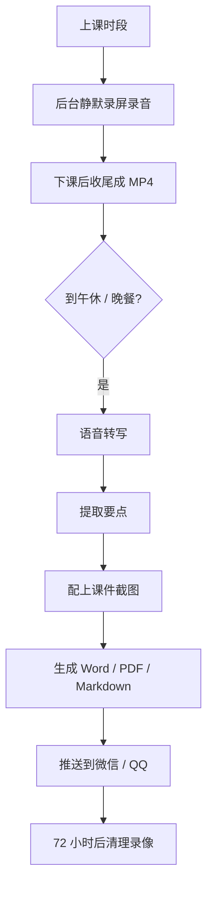
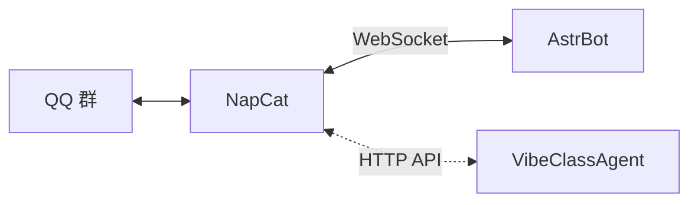

# VibeClassAgent 使用手册

> 一个挂在教室一体机上、自己录课并整理成文档的工具。
> 上课它自己录，下课它自己整理，然后把带图的课堂纪要发到你微信或 QQ 群里。

**全程不需要盯着它**：配好一次，之后每节课自动完成。

---

## 一、第一次使用（大约 5 分钟）

### 1. 把文件夹拷到一体机上

整个 `VibeClassAgent` 文件夹拷过去就行，放在**非系统盘**（比如 `D:\VibeClassAgent`）。

> 目录名别带中文和空格，少一层麻烦。
> 数据都存在这个文件夹里，所以**拷走整个文件夹就等于搬家**。

### 2. 双击「启动.cmd」

会弹出一个界面窗口 —— 没有地址栏和标签栏，看起来就是个普通程序。

> 如果提示"Windows 已保护你的电脑"，点「更多信息」→「仍要运行」。
> 这是没买代码签名证书的正常提示。

### 3. 配四样东西

界面左侧从上到下，配这几页就够了：

| 顺序 | 页面 | 要做什么 | 能不能跳过 |
|---|---|---|---|
| 1 | **模型 API** | 选服务商 → 粘 API Key → 保存 | 能。不配则课后只做原文摘要，不提炼要点 |
| 2 | **推送** | 选渠道 → 填参数 → 保存 → **点「发送测试消息」** | 能。不配则文档只存在本地，不往外发 |
| 3 | **时间表** | 把你学校的作息填进去（哪些时段上课、哪个时段午休） | **不能**。程序靠它判断什么时候录、什么时候处理 |
| 4 | **课表** | 填每周哪节课要录 | **不能**。不填就不知道录什么 |

**第 3 步最关键**：时间表里凡是名字带「午休」「午餐」「晚餐」「放学」的休息段，
程序会**自动挑出来当课后处理时段** —— 这正好也是 DeepSeek 的闲时（半价）。

### 4. 点「开始工作」

左侧「运行」页 → 点「开始工作」。之后就可以不管它了。

> 不放心的话先点「**先演练一遍**」：它会走完整流程但不真录、不真推，
> 你能在「作业」页看到它打算干什么。

---

## 二、它每天是怎么干活的



几个要点：

- **录音包含两路**：一体机自己播放的声音（课件视频里的讲解）＋ 麦克风（你说话）
- **录屏全程静默**：不弹窗、不提示、不打扰上课
- **转写在本地做**：录屏和录音**不会上传**，只有转成文字之后才会把文字发给模型
- **推送失败就不删录像**：一直发不出去就一直留着，宁可占磁盘也不丢东西
- **清理从推送成功那一刻算起**，72 小时后删除

---

## 三、界面各页说明

### 概览
一眼看到三项是否就绪：模型 API / 推送渠道 / 本地转写。
三个都是绿的，就说明可以跑了。

### 运行
- **开始工作**：启动守护进程，之后自动录课、自动处理
- **先演练一遍**：走完整流程但不真录不真推，用来确认配置对不对
- **停止**：停止工作。如果此刻正在录，它会**先把录像写完再停**，不会留半截文件
- **查看日志**：看它最近在干什么 —— 出问题时先看这里

### 模型 API
- **服务商**：下拉选一个（DeepSeek / 月之暗面 / 智谱 / 通义 等），地址会自动填好
- **接口地址**：选完服务商就不用管了；用自建代理才需要改
- **模型名**：点「拉取列表」直接从服务商那里取，点一下填进去
- **API Key**：粘进去保存即可，存在本机 `secrets.env` 里，不会进代码仓库
- **DeepSeek 错峰**：默认开着。高峰期（工作日 9:00–12:00、14:00–18:00）它会先把任务攒着，
  等闲时（半价）再跑。想让它立刻跑就取消勾选

### 推送
选渠道后，下面会**自动出现这个渠道需要的字段**：

| 渠道 | 需要填什么 | 说明 |
|---|---|---|
| **OneBot 11（NapCat）** | 服务地址 + 群号 + access_token | 功能最全，能发文件。见第四节 |
| **企业微信机器人** | 一个 Webhook 地址 | **最省事**，不装任何东西 |
| **QQ 官方机器人** | AppID + AppSecret + 群号 | 合规，但需先在 QQ 开放平台审核 |
| **Server 酱** | 一个 SendKey | 推到你微信 |
| **通用 Webhook** | 一个 HTTP 地址 | 对接自己的服务 |
| **个人微信** | 第三方协议服务地址 | **有账号风险**，自行评估 |

**配完一定要点「发送测试消息」**。它会把实际用到的配置打出来（token 打码），
成功就是真发出去了，失败会给你**原始错误**，可以直接照着排查。

### 时间表
把一天分成「上课」和「休息」两类时段。加一段、改时间、改类型、起名字，保存即可。

- 名字里带「**午休 / 午餐 / 中午**」或「**晚餐 / 放学 / 晚自习**」的休息段，
  会自动变成课后处理时段
- 保存后会立刻显示**推导出了哪几个处理窗口**，没推导出来就是名字没对上

### 课表
决定"哪节课要录"。可以加条目、改课程名、选单双周。

- **单双周可以排在同一时段**，程序不会当成冲突
- 保存时会给出检查结果：时间有没有重叠、有没有漏填教师

### 录制与文件
- **画质 / 帧率 / 截图间隔**：默认是按"占用尽量低"选的，一体机配置一般就不建议调高
  （45 分钟大约 100 MB）
- **录像保留小时数**：默认 72 小时
- **录音来源**：默认「系统声音 + 麦克风」，也可以只留一路
- **桌面悬浮窗**：下课时在屏幕角落显示提示，不需要就取消勾选

### 作业
每上完一节课生成一条记录。状态走完 `已录 → 已转写 → 已出文档 → 已推送` 就算结束。
出问题时「备注」列会写清楚原因。

---

## 四、推送配置：NapCat 怎么接（推荐）

想要"推到 QQ 群、还能带 Word 文件"，用这条路。参考
[NapCat 官方仓库](https://github.com/NapNeko/NapCatQQ)。

1. 下载 NapCat，用它登录一个 QQ 号
   > **建议用小号**：这属于第三方协议登录，有账号风险
2. 在 NapCat 配置里打开 **HTTP 服务端**，记下端口（默认 3000）和 access_token
3. 把这个 QQ 号拉进你要收课堂纪要的群
4. 回到本程序「推送」页：渠道选 **OneBot 11**，填：
   - 服务地址：`http://127.0.0.1:3000`
   - 目标：群号；类型选「群」
   - 访问令牌：NapCat 里那个 access_token
5. 保存 → **发送测试消息**

### 已经在用 AstrBot 的情况

AstrBot 也需要一个 OneBot 实现（同样是 NapCat）。三者关系是：



**NapCat 可以同时开 HTTP 和 WebSocket**，所以 AstrBot 走 WS、本程序走 HTTP，
两者互不干扰 —— **不需要让本程序经过 AstrBot 中转**，直连同一个 NapCat 更省事。

---

## 五、出问题了怎么查

### 先看「运行」页的「查看日志」
绝大多数问题在那里能直接看到原因。

### 按现象排查

| 现象 | 原因 | 怎么办 |
|---|---|---|
| **没录上** | 时间表与课表对不上 | 「运行」页看日志有没有"载入 0 节课"；对照时间表的上课时段与课表条目的时间 |
| **录到了但没声音** | 麦克风权限 / 音频来源设错 | Windows「设置 → 隐私和安全性 → 麦克风」允许桌面应用；「录制与文件」页确认录音来源 |
| **课后没收到文档** | 推送没配通 | 「推送」页点「发送测试消息」看原始报错 |
| 推送报 `connection refused` | NapCat 没起来或端口不对 | 确认 NapCat 在跑、端口与填的一致 |
| 推送报 `403` | token 不对 | 与 NapCat 里设的 access_token 核对 |
| 推送显示成功但群里没消息 | 目标填错了 | 发群必须选「群」并填群号；填 QQ 号只会私聊 |
| **转写失败** | 本地模型缺失 | 「概览」页看「本地转写」是不是红的；重新跑 `scripts/fetch-deps.py` |
| **要点提取降级** | 模型 API 没配好 | 「模型 API」页确认服务商、地址、模型名、Key 都填了 |
| **界面打不开** | 端口被占 | 换一个端口启动：`vca.exe gui --port 18080` |
| 麦克风录不到 | 系统隐私设置 | 见上一行 |

### 想确认某个设备到底行不行
命令行跑（在程序文件夹里打开 PowerShell）：

```powershell
.\vca.exe doctor                  # 环境自检：ffmpeg / whisper / 模型 / 浏览器
.\vca.exe debug audio             # 查系统声音与麦克风端点
.\vca.exe debug record-test       # 录 10 秒，确认录屏录音真的能用
.\vca.exe debug push-test         # 直接发一条测试消息
.\vca.exe debug e2e               # 端到端冒烟：录 15 秒跑完整流程
```

---

## 六、命令行（可选）

日常用界面就够了，这些是给排查和脚本化用的：

```powershell
.\vca.exe gui                     # 打开界面（双击启动.cmd 也是这个）
.\vca.exe chat                    # 进交互式命令行界面
.\vca.exe setup                   # 逐项引导配置
.\vca.exe doctor --fix            # 自检并补齐缺失的目录与配置
.\vca.exe run                     # 不开界面，直接跑守护进程
.\vca.exe import classisland "C:\...\Default.json"   # 从 ClassIsland 导入课表
.\vca.exe --help                  # 全部子命令
```

---

## 七、数据在哪 / 怎么搬家

**默认全部在程序文件夹里，不碰 C 盘用户目录。**

```
VibeClassAgent\
├─ data\          录像、音频、截图、生成的文档、作业记录
│  └─ profiles\default\
│     ├─ raw\           录像
│     ├─ docs\          生成的文档
│     ├─ screenshots\   课件截图
│     ├─ jobs\          作业记录
│     └─ logs\          运行日志
└─ config\        配置
   ├─ secrets.env       API Key 等（**别拷给别人**）
   ├─ profiles\default\settings.yaml
   ├─ timetable\current.yaml
   └─ schedule\current.yaml
```

**搬家**：整个文件夹拷走即可，换台机器接着用。

**想放别处**（比如录像太大要单独放一个盘）：

```powershell
.\vca.exe --data-dir D:\课堂数据 --config-dir D:\课堂配置 gui
```

---

## 八、隐私与安全

- **录屏和录音不会上传**。只有转写成文字之后，才会把文字发给你自己配置的模型
- **API Key 存在本机** `config\secrets.env`，不在代码里、不进版本库
- **界面服务只监听本机**（127.0.0.1），外网访问不到；每次启动还会带一个随机令牌
- **关掉窗口不等于退出程序** —— 后台服务还在跑。要彻底退出请点界面右上角「退出」
- **推送失败就不删录像**，所以不会出现"没发出去还被清理了"的情况

---

## 九、界面上没有的功能

以下只在命令行提供，日常用不到：

| 命令 | 用途 |
|---|---|
| `vca plugin list` | 查看插件（推送、转写等都可以换成插件实现） |
| `vca plugin install <路径>` | 安装插件 |
| `vca clean` | 预览可清理的录像；`vca clean --run` 真正删除 |
| `vca profile list` | 多教师共用一台机器时的身份管理 |
| `vca reset-setup` | 清掉初始化标记，重新走一遍引导 |
