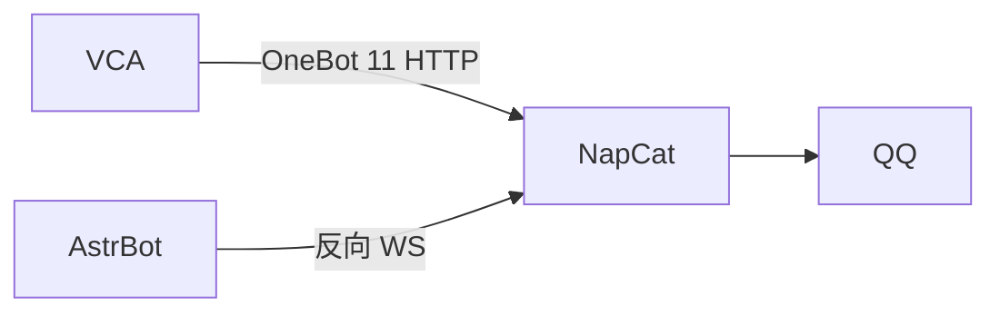

# 参考项目分析：梦汐 QQBot 启动器 v1.1.2

> 用户提供的可运行私人账号机器人，路径 `D:\...梦汐QQBot启动器v1.1.2`。
> 本文记录**读了什么、能借鉴什么、哪些不采用**，以及对本项目产生的影响。

## 一、目录构成（实际读到的）

```
梦汐QQBot启动器v1.1.2/
├── 梦汐QQBot启动器 v1.1.2.lnk
├── 梦汐QQBot启动器v1.1.2/           ← 主目录
│   ├── 梦汐QQBot启动器v1.1.2.exe    714 MB（打包了 Python + 全部依赖）
│   ├── launcher/                    启动器本体（PyInstaller 打包，含 _internal）
│   ├── python/                      内嵌 Python 运行时
│   ├── NapCat/                      NapCat.44498.Shell（含 QQ.exe 与 versions/）
│   └── AstrBot/AstrBot/             AstrBot 源码（Python 框架）
└── data/
    ├── cmd_config.json              AstrBot 的主配置（8.5 KB）
    └── t2i_templates/*.html         文字转图模板
```

**技术栈**：Electron/PyInstaller 启动器 + 内嵌 Python + AstrBot + NapCat。
程序本体 714 MB，其中绝大部分是内嵌运行时。

## 二、可复用的点（已落地到本项目）

### 1. NapCat 的 OneBot 配置结构 —— 直接解决了 404 问题 ★

这是**价值最高的一条**。从它的真实配置里读到了 `onebot11_<QQ>.json` 的结构：

```json
{
  "network": {
    "httpServers": [],          ← 空 = HTTP 服务端没开
    "websocketClients": [ { "enable": true, "name": "...", "url": "ws://...",
                            "messagePostFormat": "array", "token": "...",
                            "heartInterval": 30000, ... } ]
  }
}
```

由此确认了本项目用户遇到的 `POST /send_private_msg → 404` 的**根因**：
NapCat 默认不开 HTTP 服务端。据此实现了「一键配置」
（`crates/vca-platform/src/napcat.rs::ensure_http_server`）。

**可复用**：字段命名风格、`enable` 开关、`messagePostFormat: "array"` 的默认值。
**需改造**：它的 `httpServers` 也是空的（那个机器人走反向 WS），
所以 `httpServers` 条目的字段是照同一套命名规则**推出来**的，
不是抄来的 —— 这一点必须在文档里标明为待真机确认。

### 2. 「控制台式」的界面组织 —— 已借鉴

它的形态是「一个启动器窗口管住所有组件」：配置、启停、日志都在里面。
本项目据此把 QQ 机器人卡片重写为**完整闭环**：
状态 → 一键安装 → 一键配置 → 启动/停止 → 日志控制台。

### 3. 日志的三个开关（`napcat.json`）—— 部分借鉴

```json
{ "fileLog": false, "consoleLog": true,
  "fileLogLevel": "debug", "consoleLogLevel": "info" }
```

提醒了一件事：**NapCat 自己的日志默认只打控制台、不落文件**。
所以本项目的日志控制台**不能只读它的日志目录**，
必须同时收我们自己重定向的那一份（`logs/vca-launcher.log`）。
`tail_logs` 就是这么做的。

### 4. AstrBot 的 `t2i`（文字转图）—— 思路借鉴，实现不采用

它的配置里有 `t2i` / `t2i_strategy: remote` / `t2i_templates/*.html`：
**用 HTML 模板渲染成图**，与本项目 `card.rs` 用 GDI 自绘是两种路线。

- **不采用的理由**：HTML 渲染要走无头浏览器，而本项目在受限环境下
  Edge 打印 PDF 已实测失败过（沙箱禁命名管道）；GDI 自绘是几十毫秒的事，
  且不依赖任何外部程序。
- **借鉴的点**：它把「用什么模板」做成可配置项，我们留的是 `Style` 结构体
  （`card.rs`），后续要换皮肤改一处即可。

### 5. AstrBot 的 `dashboard` —— 印证了方向

它的配置里有 `dashboard: { enable, host, port, username, password, jwt_secret }`：
一个自带 Web 面板，用来配置 + 看日志。
这与本项目「GUI 起本地 HTTP 服务」的形态一致，
说明这条路（而不是 Electron 打包）在资源受限的机器上更合理。

## 三、明确不采用的点

| 它的做法 | 为什么不用 |
|---|---|
| 内嵌 Python 运行时 | 本体 714 MB；本项目目标是一体机，追求「拷过去就能跑」且体积可控（当前发布包 190 MB，其中大头是 whisper 模型） |
| 内嵌 AstrBot 框架 | AstrBot 是对话机器人框架（LLM + 插件体系），职责与 VCA 不同。VCA 只需要「把文档推出去」，直连 NapCat 的 OneBot 接口更短 |
| Electron/PyInstaller 启动器 | 那是另一套运行时；本项目 GUI 用系统自带 Edge 以应用模式打开，零额外运行时 |
| `launcher.exe` 内部逻辑 | 它是 PyInstaller 打包产物（`_internal` + `.pyd`），**读不到源码** —— 所以本文只分析配置与目录结构，不臆测它的代码 |

## 四、关系图



**两者可以同时挂在同一个 NapCat 上**：AstrBot 走反向 WebSocket、
VCA 走 HTTP 服务端，互不干扰。不必让 VCA 经过 AstrBot 中转。

## 五、待真机确认（不臆测）

- `httpServers` 条目的字段名是否为 NapCat 实际认的那一套 ——
  本文是按同文件里 `websocketClients` 的命名风格推的。
  **验证方式**：点一次界面上的「一键配置」，重启 NapCat，
  看 WebUI（默认 6099）的网络配置里是否出现这条 HTTP 服务器。
- 若字段有出入，程序会把原配置备份成 `.bak`，可直接还原。
